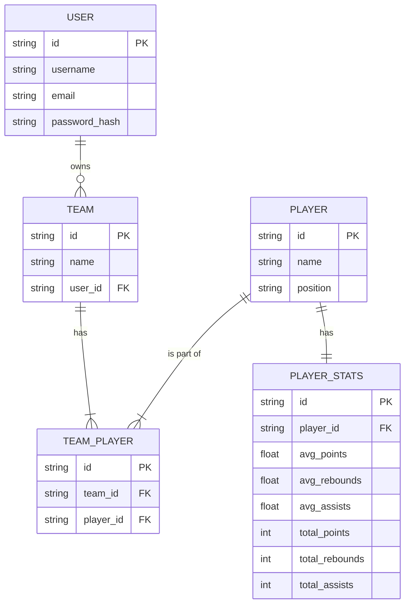

# NBA Fantasy Zone 

## Overview

NBA Fantasy Zone is a web application designed to enhance the experience of fantasy basketball fans. This platform aims to streamline the draft process, provide valuable insights, and offer an intuitive interface for managing fantasy basketball teams throughout the NBA season.

### Problem Space

Fantasy basketball participants often face challenges such as:
- Lack of exciting fantasy draft web apps
- Lack of real-time information during live drafts
- Difficulty in tracking player statistics and projections
- Inefficient team management tools
- Limited ability to analyze draft strategies and outcomes

NBA Fantasy Zone addresses these pain points by offering a comprehensive solution that combines live draft support, player analysis, and team management features.

### User Profile

The target users for this application include:

- Casual to hardcore NBA fans
- Fantasy basketball players of all experience levels
- League managers seeking efficient draft organization tools
- Sports analytics enthusiasts

### Features

1. Live Draft Selection
2. Player Analysis
3. Team Management
4. Real-time NBA data integration
5. Post-draft reports

## Implementation

### Tech Stack

- React
- Sass
- Node
- Express
- MySql
- Axios

### APIs

- [NBA.com API](https://github.com/swar/nba_api)
- [balldontlie API](https://github.com/ynnadkrap/balldontlie)
- [stats-tracker API](https://github.com/reymaa19/nba-stats-tracker)
- [NBA News API](https://github.com/kevinn03/nba_api)

### Sitemap
1. Home  
2. Login/Register
3. Dashboard  
3.1. My Team  
3.2. Other Teams 
4. Draft Room  
4.1. Live Draft Board  
4.2. Player Pool  
4.3. Team Roster  
5. Player Analysis  
5.1. Player Profile  
5.2. Comparison Tool  
6. User Profile  
6.1. Account Settings
<!-- 7. Team Management  
7.1. Roster Management  
7.2. Trade Center   -->

### Data

### Endpoints
User Management:  
POST /api/users/register  
POST /api/users/login  
GET /api/users/profile  

Player Information:  
GET /api/players  
GET /api/players/{position}  
GET /api/players/{playerId}/totals  
GET /api/players/{playerId}/stats  
GET /api/players/{playerId}/current  

Team Management:  
POST /api/teams/  
GET /api/teams/{teamId}  
<!-- PUT /api/teams/{teamId}   -->
<!-- POST /api/teams/{teamId}/trade   -->

<!-- Draft Operations:  
POST /api/drafts/start  
GET /api/drafts/{draftId}/status  
POST /api/drafts/{draftId}/pick   -->

## Roadmap
1. Project Setup and Infrastructure  
    1.1. Set up version control (Git repository)  
    1.2. Initialize frontend project with React  
    1.3. Set up backend project with Node.js and Express  
    1.4. Configure MySQL database  
    1.5. Implement API structure with Express  

2. User Authentication  
    2.1. Implement user registration functionality  
    2.2. Create login system  
    2.3. Set up JWT for session management  
    2.4. Design and implement user profile pages  

3. Player Database  
    3.1. Design player data model  
    3.2. Integrate with a basic NBA player stats API  
    3.3. Implement player search functionality  
    3.4. Create player profile cards with basic stats  
    3.5. Develop a system to regularly update player data  

4. Draft Room - Basic Functionality  
    4.1. Design and implement draft room UI  
    4.2. Create draft order generation system  
    4.3. Implement basic player selection mechanism  

5. Basic Scoring System  
    5.1. Implement a standard scoring system  
    5.2. Create a basic algorithm to calculate team scores based on player performances  
    5.3. Develop a simple leaderboard for all teams 

6. User Interface and Experience  
    6.1. Design and implement a responsive layout for the main pages  
    6.2. Create a navigation system between different sections of the app  
    6.3. Implement basic error handling and user feedback mechanisms  

## Future Implementations
- **League Management**
- AI-powered draft recommendations
- Advanced player projections
- Trade proposal system
- Waiver wire functionality
- Advanced analytics and reporting
- Social features and sharing