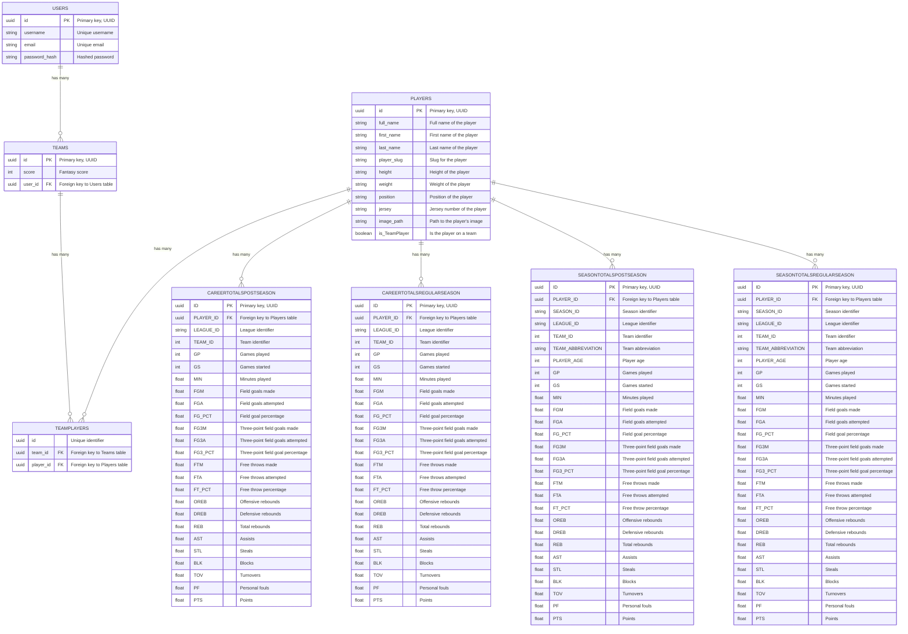

```mermaid
erDiagram
    USERS {
        uuid id PK "Primary key, UUID"
        string username "Unique username"
        string email "Unique email"
        string password_hash "Hashed password"
    }

    TEAMS {
        uuid id PK "Primary key, UUID"
        int score "Fantasy score"
        uuid user_id FK "Foreign key to Users table"
    }

    TEAMPLAYERS {
        uuid id "Unique identifier"
        uuid team_id FK "Foreign key to Teams table"
        uuid player_id FK "Foreign key to Players table"
    }

    PLAYERS {
        uuid id PK "Primary key, UUID"
        string full_name "Full name of the player"
        string first_name "First name of the player"
        string last_name "Last name of the player"
        string player_slug "Slug for the player"
        string height "Height of the player"
        string weight "Weight of the player"
        string position "Position of the player"
        string jersey "Jersey number of the player"
        string image_path "Path to the player's image"
        boolean is_TeamPlayer "Is the player on a team"
    }

    CAREERTOTALSPOSTSEASON {
        uuid ID PK "Primary key, UUID"
        uuid PLAYER_ID FK "Foreign key to Players table"
        string LEAGUE_ID "League identifier"
        int TEAM_ID "Team identifier"
        int GP "Games played"
        int GS "Games started"
        float MIN "Minutes played"
        float FGM "Field goals made"
        float FGA "Field goals attempted"
        float FG_PCT "Field goal percentage"
        float FG3M "Three-point field goals made"
        float FG3A "Three-point field goals attempted"
        float FG3_PCT "Three-point field goal percentage"
        float FTM "Free throws made"
        float FTA "Free throws attempted"
        float FT_PCT "Free throw percentage"
        float OREB "Offensive rebounds"
        float DREB "Defensive rebounds"
        float REB "Total rebounds"
        float AST "Assists"
        float STL "Steals"
        float BLK "Blocks"
        float TOV "Turnovers"
        float PF "Personal fouls"
        float PTS "Points"
    }

    CAREERTOTALSREGULARSEASON {
        uuid ID PK "Primary key, UUID"
        uuid PLAYER_ID FK "Foreign key to Players table"
        string LEAGUE_ID "League identifier"
        int TEAM_ID "Team identifier"
        int GP "Games played"
        int GS "Games started"
        float MIN "Minutes played"
        float FGM "Field goals made"
        float FGA "Field goals attempted"
        float FG_PCT "Field goal percentage"
        float FG3M "Three-point field goals made"
        float FG3A "Three-point field goals attempted"
        float FG3_PCT "Three-point field goal percentage"
        float FTM "Free throws made"
        float FTA "Free throws attempted"
        float FT_PCT "Free throw percentage"
        float OREB "Offensive rebounds"
        float DREB "Defensive rebounds"
        float REB "Total rebounds"
        float AST "Assists"
        float STL "Steals"
        float BLK "Blocks"
        float TOV "Turnovers"
        float PF "Personal fouls"
        float PTS "Points"
    }

    SEASONTOTALSPOSTSEASON {
        uuid ID PK "Primary key, UUID"
        uuid PLAYER_ID FK "Foreign key to Players table"
        string SEASON_ID "Season identifier"
        string LEAGUE_ID "League identifier"
        int TEAM_ID "Team identifier"
        string TEAM_ABBREVIATION "Team abbreviation"
        int PLAYER_AGE "Player age"
        int GP "Games played"
        int GS "Games started"
        float MIN "Minutes played"
        float FGM "Field goals made"
        float FGA "Field goals attempted"
        float FG_PCT "Field goal percentage"
        float FG3M "Three-point field goals made"
        float FG3A "Three-point field goals attempted"
        float FG3_PCT "Three-point field goal percentage"
        float FTM "Free throws made"
        float FTA "Free throws attempted"
        float FT_PCT "Free throw percentage"
        float OREB "Offensive rebounds"
        float DREB "Defensive rebounds"
        float REB "Total rebounds"
        float AST "Assists"
        float STL "Steals"
        float BLK "Blocks"
        float TOV "Turnovers"
        float PF "Personal fouls"
        float PTS "Points"
    }

    SEASONTOTALSREGULARSEASON {
        uuid ID PK "Primary key, UUID"
        uuid PLAYER_ID FK "Foreign key to Players table"
        string SEASON_ID "Season identifier"
        string LEAGUE_ID "League identifier"
        int TEAM_ID "Team identifier"
        string TEAM_ABBREVIATION "Team abbreviation"
        int PLAYER_AGE "Player age"
        int GP "Games played"
        int GS "Games started"
        float MIN "Minutes played"
        float FGM "Field goals made"
        float FGA "Field goals attempted"
        float FG_PCT "Field goal percentage"
        float FG3M "Three-point field goals made"
        float FG3A "Three-point field goals attempted"
        float FG3_PCT "Three-point field goal percentage"
        float FTM "Free throws made"
        float FTA "Free throws attempted"
        float FT_PCT "Free throw percentage"
        float OREB "Offensive rebounds"
        float DREB "Defensive rebounds"
        float REB "Total rebounds"
        float AST "Assists"
        float STL "Steals"
        float BLK "Blocks"
        float TOV "Turnovers"
        float PF "Personal fouls"
        float PTS "Points"
    }

    USERS ||--o{ TEAMS : "has many"
    TEAMS ||--o{ TEAMPLAYERS : "has many"
    PLAYERS ||--o{ TEAMPLAYERS : "has many"
    PLAYERS ||--o{ CAREERTOTALSPOSTSEASON : "has many"
    PLAYERS ||--o{ CAREERTOTALSREGULARSEASON : "has many"
    PLAYERS ||--o{ SEASONTOTALSPOSTSEASON : "has many"
    PLAYERS ||--o{ SEASONTOTALSREGULARSEASON : "has many"
```
